# MIN3D
[](https://doi.org/10.1007/s41064-023-00260-0)
[](http://zasobynauki.pl/zasoby/83117)


<div align="left">
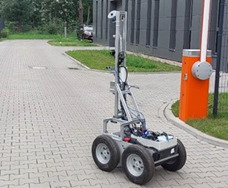
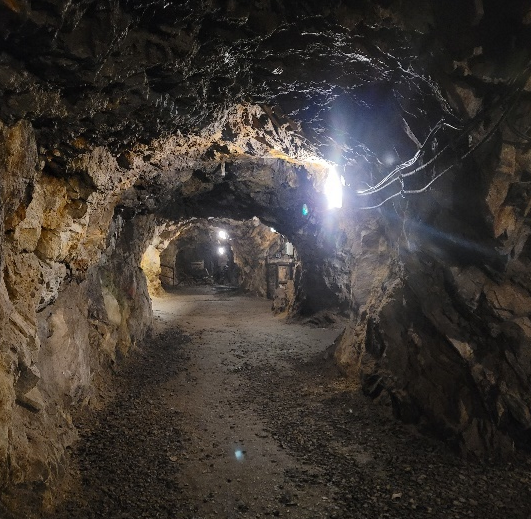
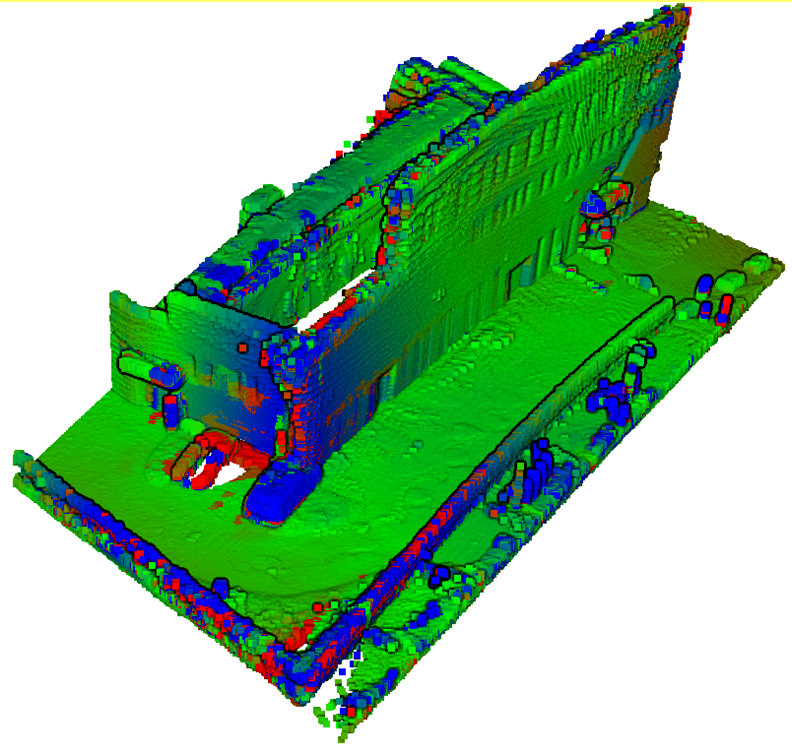
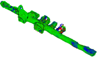
</div>

## MultI-seNsor 3D mapping with an unmanned ground vehicle for mining applications

#### Robotic dataset for developing mobile mapping solutions for challenging, GNSS-denied and subterranean environments
### Authors
Paweł Trybała, Jarosław Szrek, Fabio Remondino, Paulina Kujawa, Jacek Wodecki, Jan Blachowski, Radosław Zimroz

## Abstract 
The research potential in the field of mobile mapping technologies, particularly for specific applications, is hindered by several constraints. These include the need for costly hardware to collect data (possibly with automation using mobile platforms such as robots or drones), limited access to target sites with specific environmental conditions, and the establishment of a ground truth model for evaluating developed solutions. To address these challenges, the utilization of open datasets presents a viable solution. However, the availability of datasets that encompass truly demanding mixed indoor-outdoor and subterranean conditions is currently limited. To alleviate this issue, we propose the MIN3D dataset (MultI-seNsor 3D mapping with an unmanned ground vehicle for mining applications). This dataset was gathered using a wheeled mobile robot in two distinct locations: (i) textureless dark corridors within a university campus and (ii) tunnels of an underground site in Walim (Poland). It comprises around 150 GB of raw data, including images captured by multiple co-calibrated monocular and stereo cameras, a thermal camera, 2 LiDARs, and 3 inertial measurement units. Reliable ground truth point clouds were obtained using a survey-grade terrestrial laser scanner. By openly sharing this dataset, we aim to support the efforts of the scientific community in developing robust methods for navigation and mapping in challenging underground conditions. In the paper, we describe the collected data and provide an initial accuracy assessment of some visual- and LiDAR-based simultaneous localization and mapping (SLAM) algorithms for selected sequences. Encountered problems, open research questions and areas that could benefit from utilizing our dataset are discussed.

## Main Contributions: 
- Challenging scenes in indoor and underground conditions, targeting typical issues of subterranean environments: variable illumination, featureless or textureless areas, repeating or complex geometry.
- Simultaneously acquired data with many sensors (cameras, LiDAR scanners, IMUs) on a single robotic platform.
- High-quality reference point clouds, acquired with a survey-grade Terrestrial Laser Scanner.

## Related papers 
<a href="https://doi.org/10.1007/s41064-023-00260-0">Trybała, P., Szrek, J., Remondino, F. et al. MIN3D Dataset: MultI-seNsor 3D Mapping with an Unmanned Ground Vehicle. PFG (2023).</a>

<a href="https://doi.org/10.5194/isprs-archives-XLVIII-2-W2-2022-135-2022">Trybała, P., Szrek, J., Remondino, F. et al. CALIBRATION OF A MULTI-SENSOR WHEELED ROBOT FOR THE 3D MAPPING OF UNDERGROUND MINING TUNNELS. Int. Arch. Photogramm. Remote Sens. Spatial Inf. Sci., XLVIII-2/W2-2022, 135–142 (2022).</a>

If you use our work, please cite:
```bibtex
@article{Trybala2023MIN3D,
  title = {MIN3D Dataset: MultI-seNsor 3D Mapping with an Unmanned Ground Vehicle},
  ISSN = {2512-2819},
  url = {http://dx.doi.org/10.1007/s41064-023-00260-0},
  DOI = {10.1007/s41064-023-00260-0},
  journal = {PFG – Journal of Photogrammetry,  Remote Sensing and Geoinformation Science},
  publisher = {Springer Science and Business Media LLC},
  author = {Trybała,  Paweł and Szrek,  Jarosław and Remondino,  Fabio and Kujawa,  Paulina and Wodecki,  Jacek and Blachowski,  Jan and Zimroz,  Radosław},
  year = {2023},
  month = oct 
}

@article{Trybala2022calibration,
  title = {CALIBRATION OF A MULTI-SENSOR WHEELED ROBOT FOR THE 3D MAPPING OF UNDERGROUND MINING TUNNELS},
  volume = {XLVIII-2/W2-2022},
  ISSN = {2194-9034},
  url = {http://dx.doi.org/10.5194/isprs-archives-XLVIII-2-W2-2022-135-2022},
  DOI = {10.5194/isprs-archives-xlviii-2-w2-2022-135-2022},
  journal = {The International Archives of the Photogrammetry,  Remote Sensing and Spatial Information Sciences},
  publisher = {Copernicus GmbH},
  author = {Trybała,  P. and Szrek,  J. and Remondino,  F. and Wodecki,  J. and Zimroz,  R.},
  year = {2022},
  month = dec,
  pages = {135–142}
}
```

# Dataset

## Sensor Setup
<div align="left">
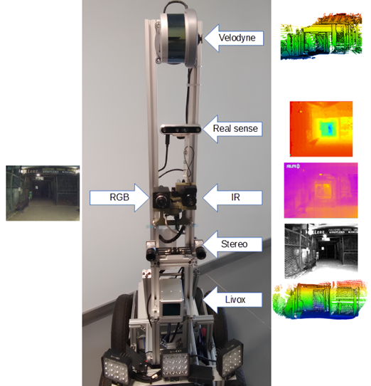
</div>

Sensor/Device|Model|Specification
:--:|:--:|:--:
Basler Stereo | acA1440-220um |2x720x540 px, 15 Hz
Intel RealSense RGB | D455 | 640x480 px, 15 Hz
Intel RealSense Stereo | D455 | 2x640x480 px, 15 Hz
Intel RealSense Depth | D455 | 640x480 px, 15 Hz
FLIR IR | VUE-640 | 640x512 px, 15 Hz
LiDAR#1 | Livox Horizon | 10 Hz, ~20 mm accuracy individual point timestamps
LiDAR#2 | Velodyne VLP-16 | 10 Hz, ~20 mm accuracy, actuated (180° rotation)
IMU#1 | Livox | 6-axis, 200 Hz
IMU#2 | RealSense | 6-axis, 400 Hz
IMU#3 | NGIMU | 6-axis, 20 Hz
GT 3D Scanner | Riegl VZ-400i | ~5 mm accuracy

Point clouds shared as .ply files

RGB/IR images as .png files

Depth maps: .png images, 16bit int - metric depth in millimeters

IMU data as .csv files

## Ground Truth Point Clouds
Acquired with a Riegl VZ-400i TLS and registered with RiScan PRO

<div align="left">
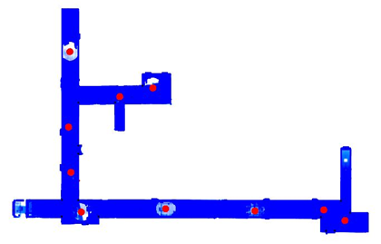
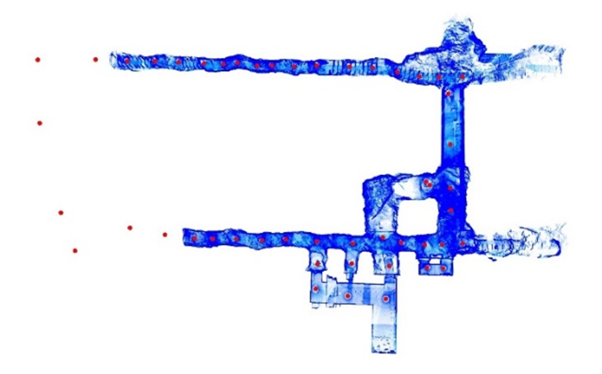
</div>


## Data Sequences
Our dataset consists of 8 sequences in total. 

<div align="left">
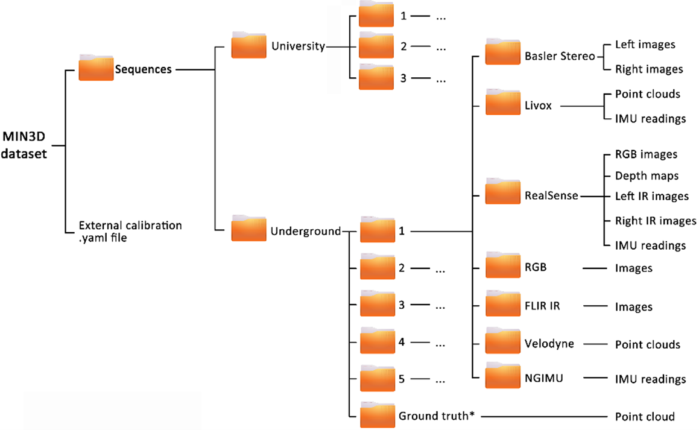
</div>

## University dataset
<table style="text-align: center">

  <tr>
    <th><b>Sequence</b></th>
    <th><b>1</b></th>
    <th><b>2</b></th>
    <th><b>3</b></th>
  </tr>
  <tr>
    <th><b>Thumbnail</b></th>
    <th>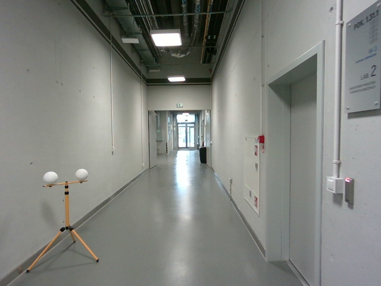</th>
    <th>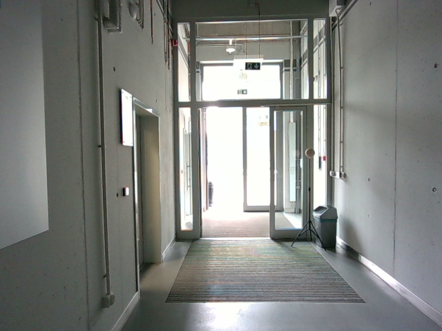</th>
    <th>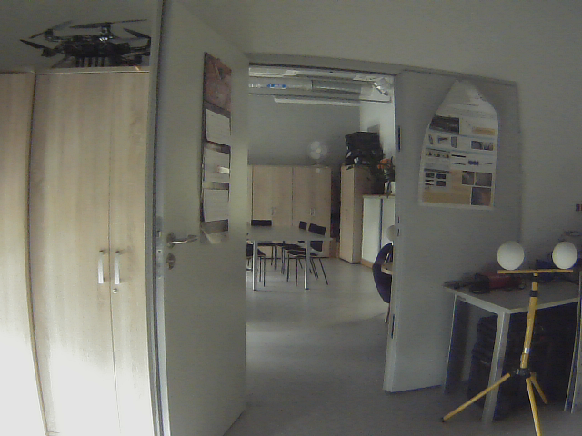</th>
  </tr>
  <tr>
    <td><b>Features</b></td>
    <td>Ground floor</td>
    <td>Ground floor-outdoor loop</td>
    <td>Multiple indoor loops with varying illumination</td>
  </tr>
  <tr>
    <td><b>Size [GB]</b></td>
    <td>26.1</td>
    <td>22.1</td>
    <td>18.9</td>
  </tr>
  <tr align="center">
    <td colspan="4"> <b>Cameras</b></td>
  </tr>
  <tr>
    <td><b>Basler stereo</b></td>
    <td><a href="https://data.e-science.pl/83117/uni_1_stereo_left.zip">uni_1_basler_left</a>, <a href="https://data.e-science.pl/83117/uni_1_stereo_right.zip">uni_1_basler_right</a></td>
    <td><a href="https://data.e-science.pl/83117/uni_2_stereo_left.zip">uni_2_basler_left</a>, <a href="https://data.e-science.pl/83117/uni_2_stereo_right.zip">uni_2_basler_right</a></td>
    <td><a href="https://data.e-science.pl/83117/uni_3_stereo_left.zip">uni_3_basler_left</a>, <a href="https://data.e-science.pl/83117/uni_3_stereo_right.zip">uni_3_basler_right</a></td>
  </td>
  <tr>
    <td><b>RGB</b></td>
    <td><a href="https://data.e-science.pl/83117/uni_1_rgb.zip">uni_1_rgb</a></td>
    <td><a href="https://data.e-science.pl/83117/uni_2_rgb.zip">uni_2_rgb</a></td>
    <td><a href="https://data.e-science.pl/83117/uni_3_rgb.zip">uni_3_rgb</a></td>
  </tr>
  <tr>
    <td><b>RealSense Stereo</b></td>
    <td><a href="https://data.e-science.pl/83117/uni_1_ir_left_rs.zip">uni_1_realsense_left</a>, <a href="https://data.e-science.pl/83117/uni_1_ir_right_rs.zip">uni_1_realsense_right</a></td>
    <td><a href="https://data.e-science.pl/83117/uni_2_ir_left_rs.zip">uni_2_realsense_left</a>, <a href="https://data.e-science.pl/83117/uni_2_ir_right_rs.zip">uni_2_realsense_right</a></td>
    <td><a href="https://data.e-science.pl/83117/uni_3_ir_left_rs.zip">uni_3_realsense_left</a>, <a href="https://data.e-science.pl/83117/uni_3_ir_right_rs.zip">uni_3_realsense_right</a></td>
  </tr>
  <tr>
    <td><b>RealSense Depth</b></td>
    <td><a href="https://data.e-science.pl/83117/uni_1_depth_rs.zip">uni_1_realsense_depth</a></td>
    <td><a href="https://data.e-science.pl/83117/uni_2_depth_rs.zip">uni_2_realsense_depth</a></td>
    <td><a href="https://data.e-science.pl/83117/uni_3_depth_rs.zip">uni_3_realsense_depth</a></td>
  </tr>
  <tr>
    <td><b>RealSense RGB</b></td>
    <td><a href="https://data.e-science.pl/83117/uni_1_rgb_rs.zip">uni_1_realsense_rgb</a></td>
    <td><a href="https://data.e-science.pl/83117/uni_2_rgb_rs.zip">uni_2_realsense_rgb</a></td>
    <td><a href="https://data.e-science.pl/83117/uni_3_rgb_rs.zip">uni_3_realsense_rgb</a></td>
  </tr>
  <tr>
    <td><b>FLIR IR</b></td>
    <td><a href="https://data.e-science.pl/83117/uni_1_ir.zip">uni_1_ir</a></td>
    <td><a href="https://data.e-science.pl/83117/uni_2_ir.zip">uni_2_ir</a></td>
    <td><a href="https://data.e-science.pl/83117/uni_3_ir.zip">uni_3_ir</a></td>
  </tr>
  <tr align="center">
    <td colspan="4"><b>IMUs</b></td>
  </tr>
  <tr>
    <td><b>Livox internal IMU</b></td>
    <td><a href="https://data.e-science.pl/83117/uni_1_imu_livox.csv">uni_1_imu_livox</a></td>
    <td><a href="https://data.e-science.pl/83117/uni_2_imu_livox.csv">uni_2_imu_livox</a></td>
    <td><a href="https://data.e-science.pl/83117/uni_3_imu_livox.csv">uni_3_imu_livox</a></td>
  </tr>
  <tr>
    <td><b>RealSense IMU</b></td>
    <td><a href="https://data.e-science.pl/83117/uni_1_imu_rs.csv">uni_1_imu_realsense</a></td>
    <td><a href="https://data.e-science.pl/83117/uni_2_imu_rs.csv">uni_2_imu_realsense</a></td>
    <td><a href="https://data.e-science.pl/83117/uni_3_imu_rs.csv">uni_3_imu_realsense</a></td>
  </tr>
  <tr>
    <td><b>NGIMU</b></td>
    <td><a href="https://data.e-science.pl/83117/uni_1_ngimu_acc.csv">uni_1_ngimu_accelerations</a>, <a href="https://data.e-science.pl/83117/uni_1_ngimu_eul.csv">uni_1_ngimu_euler_angles</a></td>
    <td><a href="https://data.e-science.pl/83117/uni_2_ngimu_acc.csv">uni_2_ngimu_accelerations</a>, <a href="https://data.e-science.pl/83117/uni_2_ngimu_eul.csv">uni_2_ngimu_euler_angles</a></td>
    <td><a href="https://data.e-science.pl/83117/uni_3_ngimu_acc.csv">uni_3_ngimu_accelerations</a>, <a href="https://data.e-science.pl/83117/uni_3_ngimu_eul.csv">uni_3_ngimu_euler_angles</a></td>
  </tr>
  <tr align="center">
    <td colspan="4"><b>LiDARs</b></td>
  </tr>
  <tr>
    <td><b>Velodyne VLP-16</b></td>
    <td><a href="https://data.e-science.pl/83117/uni_1_velodyne_lidar.zip">uni_1_velodyne</a></td>
    <td><a href="https://data.e-science.pl/83117/uni_2_velodyne_lidar.zip">uni_2_velodyne</a></td>
    <td><a href="https://data.e-science.pl/83117/uni_3_velodyne_lidar.zip">uni_3_velodyne</a></td>
  </tr>
  <tr>
    <td><b>Livox</b></td>
    <td><a href="https://data.e-science.pl/83117/uni_1_livox_lidar.zip">uni_1_livox</a></td>
    <td><a href="https://data.e-science.pl/83117/uni_2_livox_lidar.zip">uni_2_livox</a></td>
    <td><a href="https://data.e-science.pl/83117/uni_3_livox_lidar.zip">uni_3_livox</a></td>
  </tr>
  <tr align="center">
    <td colspan="4"><b>Ground truth</b></td>
  </tr>
  <tr>
    <td><b>Riegl VZ-400i</b></td>
    <td><a href="https://data.e-science.pl/83117/uni_1_university_1_gt.las">uni_1_gt</a></td>
    <td><a href="https://data.e-science.pl/83117/uni_2_university_2_gt.las">uni_2_gt</a></td>
    <td><a href="https://data.e-science.pl/83117/uni_3_university_3_gt.las">uni_3_gt</a></td>
  </tr>
  <tr>
    <td><b>Calibration data</b></td>
    <td colspan="3" align="center"><a href="https://data.e-science.pl/83117/calibration.yaml">calibration</a></td>
  </tr>
</table>

## Underground dataset
<table style="text-align: center">

  <tr>
    <th><b>Sequence</b></th>
    <th><b>1</b></th>
    <th><b>2</b></th>
    <th><b>3</b></th>
    <th><b>4</b></th>
    <th><b>5</b></th>
  </tr>
  <tr>
    <td><b>Features</b></td>
    <td>Main tunnel, forward pass</td>
    <td>Main tunnel, return pass</td>
    <td>Loop closures, complicated trajectory</td>
    <td>Lost camera problem, loop closures</td>
    <td>Side tunnel, less structured</td>
  </tr>
  <tr>
    <td><b>Size [GB]</b></td>
    <td>13.2</td>
    <td>10.8</td>
    <td>17.9</td>
    <td>13.9</td>
    <td>22.5</td>
  </tr>
  <tr align="center">
    <td colspan="6"> <b>Cameras</b></td>
  </tr>
  <tr>
    <td><b>Basler stereo</b></td>
    <td><a href="https://data.e-science.pl/83117/und_1_stereo_left.zip">und_1_basler_left</a>, <a href="https://data.e-science.pl/83117/und_1_stereo_right.zip">und_1_basler_right</a></td>
    <td><a href="https://data.e-science.pl/83117/und_2_stereo_left.zip">und_2_basler_left</a>, <a href="https://data.e-science.pl/83117/und_2_stereo_right.zip">und_2_basler_right</a></td>
    <td><a href="https://data.e-science.pl/83117/und_3_stereo_left.zip">und_3_basler_left</a>, <a href="https://data.e-science.pl/83117/und_3_stereo_right.zip">und_3_basler_right</a></td>
    <td><a href="https://data.e-science.pl/83117/und_4_stereo_left.zip">und_4_basler_left</a>, <a href="https://data.e-science.pl/83117/und_4_stereo_right.zip">und_4_basler_right</a></td>
    <td><a href="https://data.e-science.pl/83117/und_5_stereo_left.zip">und_5_basler_left</a>, <a href="https://data.e-science.pl/83117/und_5_stereo_right.zip">und_5_basler_right</a></td>
  </td>
  <tr>
    <td><b>RGB</b></td>
    <td><a href="https://data.e-science.pl/83117/und_1_rgb.zip">und_1_rgb</a></td>
    <td><a href="https://data.e-science.pl/83117/und_2_rgb.zip">und_2_rgb</a></td>
    <td><a href="https://data.e-science.pl/83117/und_3_rgb.zip">und_3_rgb</a></td>
    <td><a href="https://data.e-science.pl/83117/und_4_rgb.zip">und_4_rgb</a></td>
    <td><a href="https://data.e-science.pl/83117/und_5_rgb.zip">und_5_rgb</a></td>
  </tr>
  <tr>
    <td><b>RealSense Stereo</b></td>
    <td><a href="https://data.e-science.pl/83117/und_1_ir_left_rs.zip">und_1_realsense_left</a>, <a href="https://data.e-science.pl/83117/und_1_ir_right_rs.zip">und_1_realsense_right</a></td>
    <td><a href="https://data.e-science.pl/83117/und_2_ir_left_rs.zip">und_2_realsense_left</a>, <a href="https://data.e-science.pl/83117/und_2_ir_right_rs.zip">und_2_realsense_right</a></td>
    <td><a href="https://data.e-science.pl/83117/und_3_ir_left_rs.zip">und_3_realsense_left</a>, <a href="https://data.e-science.pl/83117/und_3_ir_right_rs.zip">und_3_realsense_right</a></td>
    <td><a href="https://data.e-science.pl/83117/und_4_ir_left_rs.zip">und_4_realsense_left</a>, <a href="https://data.e-science.pl/83117/und_4_ir_right_rs.zip">und_4_realsense_right</a></td>
    <td><a href="https://data.e-science.pl/83117/und_5_ir_left_rs.zip">und_5_realsense_left</a>, <a href="https://data.e-science.pl/83117/und_5_ir_right_rs.zip">und_5_realsense_right</a></td>
  </tr>
  <tr>
    <td><b>RealSense Depth</b></td>
    <td><a href="https://data.e-science.pl/83117/und_1_depth_rs.zip">und_1_realsense_depth</a></td>
    <td><a href="https://data.e-science.pl/83117/und_2_depth_rs.zip">und_2_realsense_depth</a></td>
    <td><a href="https://data.e-science.pl/83117/und_3_depth_rs.zip">und_3_realsense_depth</a></td>
    <td><a href="https://data.e-science.pl/83117/und_4_depth_rs.zip">und_4_realsense_depth</a></td>
    <td><a href="https://data.e-science.pl/83117/und_5_depth_rs.zip">und_5_realsense_depth</a></td>
  </tr>
  <tr>
    <td><b>RealSense RGB</b></td>
    <td><a href="https://data.e-science.pl/83117/und_1_rgb_rs.zip">und_1_realsense_rgb</a></td>
    <td><a href="https://data.e-science.pl/83117/und_2_rgb_rs.zip">und_2_realsense_rgb</a></td>
    <td><a href="https://data.e-science.pl/83117/und_3_rgb_rs.zip">und_3_realsense_rgb</a></td>
    <td><a href="https://data.e-science.pl/83117/und_4_rgb_rs.zip">und_4_realsense_rgb</a></td>
    <td><a href="https://data.e-science.pl/83117/und_5_rgb_rs.zip">und_5_realsense_rgb</a></td>
  </tr>
  <tr>
    <td><b>FLIR IR</b></td>
    <td><a href="https://data.e-science.pl/83117/und_1_ir.zip">und_1_ir</a></td>
    <td><a href="https://data.e-science.pl/83117/und_2_ir.zip">und_2_ir</a></td>
    <td><a href="https://data.e-science.pl/83117/und_3_ir.zip">und_3_ir</a></td>
    <td><a href="https://data.e-science.pl/83117/und_4_ir.zip">und_4_ir</a></td>
    <td><a href="https://data.e-science.pl/83117/und_5_ir.zip">und_5_ir</a></td>
  <tr align="center">
    <td colspan="6"><b>IMUs</b></td>
  </tr>
  <tr>
    <td><b>Livox internal IMU</b></td>
    <td><a href="https://data.e-science.pl/83117/und_1_imu_livox.csv">und_1_imu_livox</a></td>
    <td><a href="https://data.e-science.pl/83117/und_2_imu_livox.csv">und_2_imu_livox</a></td>
    <td><a href="https://data.e-science.pl/83117/und_3_imu_livox.csv">und_3_imu_livox</a></td>
    <td><a href="https://data.e-science.pl/83117/und_4_imu_livox.csv">und_4_imu_livox</a></td>
    <td><a href="https://data.e-science.pl/83117/und_5_imu_livox.csv">und_5_imu_livox</a></td>
  </tr>
  <tr>
    <td><b>RealSense IMU</b></td>
    <td><a href="https://data.e-science.pl/83117/und_1_imu_rs.csv">und_1_imu_realsense</a></td>
    <td><a href="https://data.e-science.pl/83117/und_2_imu_rs.csv">und_2_imu_realsense</a></td>
    <td><a href="https://data.e-science.pl/83117/und_3_imu_rs.csv">und_3_imu_realsense</a></td>
    <td><a href="https://data.e-science.pl/83117/und_4_imu_rs.csv">und_4_imu_realsense</a></td>
    <td><a href="https://data.e-science.pl/83117/und_5_imu_rs.csv">und_5_imu_realsense</a></td>
  </tr>
  <tr>
    <td><b>NGIMU</b></td>
    <td><a href="https://data.e-science.pl/83117/und_1_ngimu_acc.csv">und_1_ngimu_accelerations</a>, <a href="https://data.e-science.pl/83117/und_1_ngimu_eul.csv">und_1_ngimu_euler_angles</a></td>
    <td><a href="https://data.e-science.pl/83117/und_2_ngimu_acc.csv">und_2_ngimu_accelerations</a>, <a href="https://data.e-science.pl/83117/und_2_ngimu_eul.csv">und_2_ngimu_euler_angles</a></td>
    <td><a href="https://data.e-science.pl/83117/und_3_ngimu_acc.csv">und_3_ngimu_accelerations</a>, <a href="https://data.e-science.pl/83117/und_3_ngimu_eul.csv">und_3_ngimu_euler_angles</a></td>
    <td><a href="https://data.e-science.pl/83117/und_4_ngimu_acc.csv">und_4_ngimu_accelerations</a>, <a href="https://data.e-science.pl/83117/und_4_ngimu_eul.csv">und_5_ngimu_euler_angles</a></td>
    <td><a href="https://data.e-science.pl/83117/und_5_ngimu_acc.csv">und_5_ngimu_accelerations</a>, <a href="https://data.e-science.pl/83117/und_5_ngimu_eul.csv">und_5_ngimu_euler_angles</a></td>
  </tr>
  <tr align="center">
    <td colspan="6"><b>LiDARs</b></td>
  </tr>
  <tr>
    <td><b>Velodyne VLP-16</b></td>
    <td><a href="https://data.e-science.pl/83117/und_1_velodyne_lidar.zip">und_1_velodyne</a></td>
    <td><a href="https://data.e-science.pl/83117/und_2_velodyne_lidar.zip">und_2_velodyne</a></td>
    <td><a href="https://data.e-science.pl/83117/und_3_velodyne_lidar.zip">und_3_velodyne</a></td>
    <td><a href="https://data.e-science.pl/83117/und_4_velodyne_lidar.zip">und_4_velodyne</a></td>
    <td><a href="https://data.e-science.pl/83117/und_5_velodyne_lidar.zip">und_5_velodyne</a></td>
  </tr>
  <tr>
    <td><b>Livox</b></td>
    <td><a href="https://data.e-science.pl/83117/und_1_livox_lidar.zip">und_1_livox</a></td>
    <td><a href="https://data.e-science.pl/83117/und_2_livox_lidar.zip">und_2_livox</a></td>
    <td><a href="https://data.e-science.pl/83117/und_3_livox_lidar.zip">und_3_livox</a></td>
    <td><a href="https://data.e-science.pl/83117/und_4_livox_lidar.zip">und_4_livox</a></td>
    <td><a href="https://data.e-science.pl/83117/und_5_livox_lidar.zip">und_5_livox</a></td>
  </tr>
  <tr align="center">
    <td colspan="6"  style="text-align: center"><b>Ground truth</b></td>
  </tr>
  <tr align="center">
    <td><b>Riegl VZ-400i</b></td>
    <td colspan="5"><a href="https://data.e-science.pl/83117/underground_gt">underground_gt (save as a .las file)</a></td>
  </tr>
  <tr>
    <td><b>Calibration data (same as University)</b></td>
    <td colspan="5" align="center"><a href="https://data.e-science.pl/83117/calibration.yaml">calibration</a></td>
  </tr>
</table>


## Acknowledgements
The authors offer special thanks to Walimskie Drifts in Walim (https://sztolnie.pl) for making the facility available for data acquisition.

## Funding
This work was partly supported by EIT RawMaterials GmbH within the activities of the AMICOS—Autonomous Monitoring and Control System for Mining Plants—project (Agreement No. 19018) and VOT3D—project (Agreement No. 21119). The work was also partly supported by the FAIR project, Piano Nazionale di Ripresa e Resilienza.

## Contact
This dataset is provided for academic purposes. For any inquiries please contact <Paweł Trybała: ptrybala@fbk.eu>.

## License
The data provided here is licensed under the [Creative Commons Attribution-NonCommercial-ShareAlike 4.0 International License](https://creativecommons.org/licenses/by-nc-sa/4.0/).
